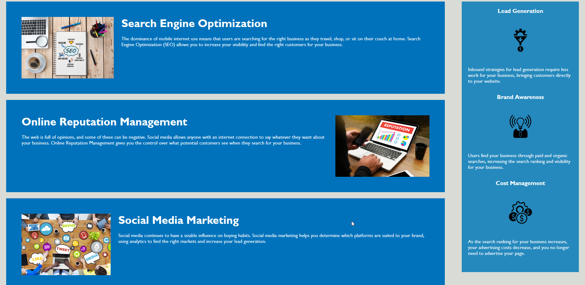

# Bootcamp Challenge 01: HTML CSS and Git - Code Refactor

## Description

This project was done to update an example marketing webpage to be more in line with modern accessability standards to be optimized for search engines. Non-semantic elements (e.g. 
) were replaced with modern HTML5 semantic elements (such as <section> and <header>). The CSS stylesheet was also consolidated and formatted to be much more readable. This website can now be easily modified going into the future. I learned a lot about refactoring HTML code and organizing CSS stylesheets.

## Installation

N/A

## Usage

Provide instructions and examples for use. Include screenshots as needed.

To add a screenshot, create an `assets/images` folder in your repository and upload your screenshot to it. Then, using the relative file path, add it to your README using the following syntax:

Website has a simple navigation functionality in the top right. Click a section to be guided to its corresponding heading.

[Link to GitHub Pages website](https://kevinpatto.github.io/Bootcamp-Challenge-01-HTML-CSS-and-Git/)

## Credits

N/A

## License

N/A